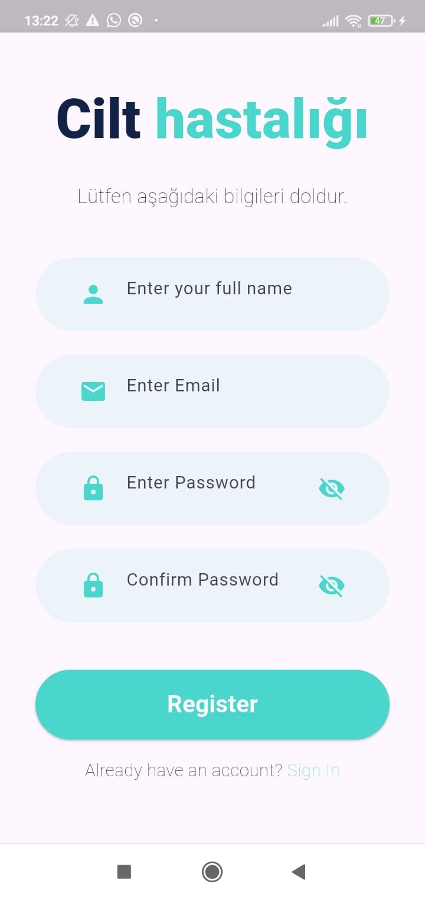
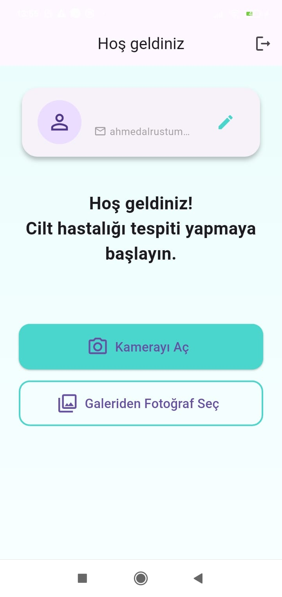
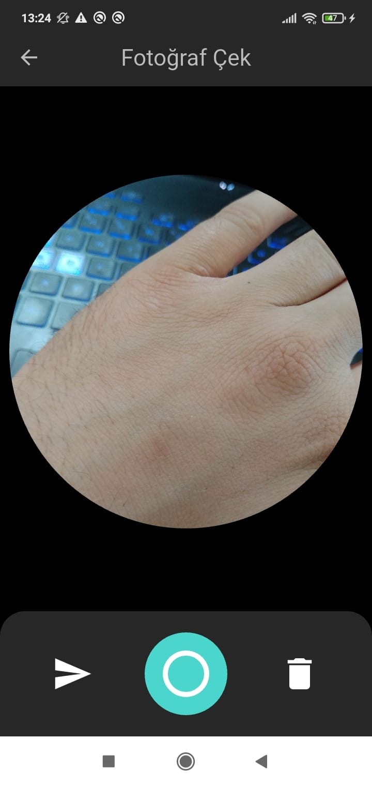
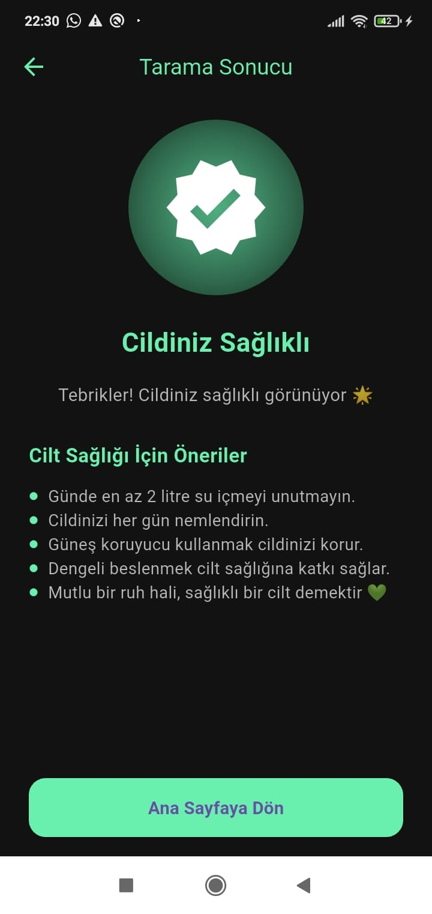
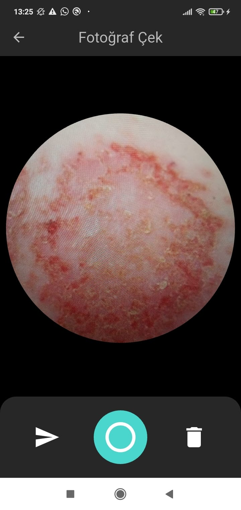
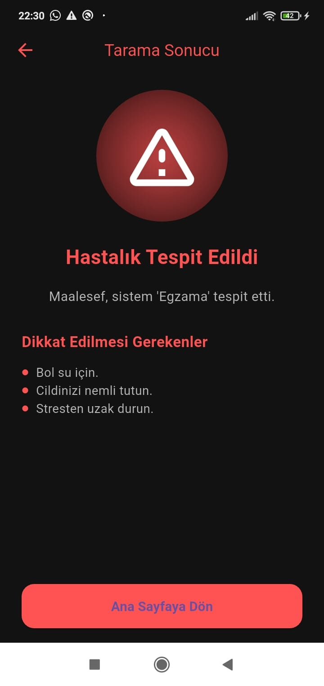

# 🩺 Cilt Hastalığı Tanı ve Öneri Uygulaması

Flutter ile geliştirilmiş bir mobil uygulamadır. Kullanıcılar, cilt hastalıklarını kamera veya galeriden yükledikleri fotoğraflar üzerinden analiz ettirip, yapay zekâ destekli sistemden tahmin ve öneri alabilirler.

---

## 🚀 Proje Hakkında

Bu mobil uygulama:
- Cilt hastalıklarını tespit etmek için **makine öğrenmesi** modelleri kullanır.
- Kullanıcı kimlik doğrulamasında **Firebase Authentication** altyapısından yararlanır.
- Fotoğraf yüklemek için **kamera ve galeri entegrasyonu** içerir.
- Kullanıcı profili yönetimi ve öneri sistemi barındırır.

---

## 📱 Özellikler

- 📸 Kamera veya galeriden fotoğraf yükleyerek cilt hastalığı tahmini
- 🔐 Firebase ile kullanıcı kaydı ve girişi
- 🧠 Görüntü işleme & makine öğrenmesi tabanlı analiz
- 📋 Hastalık ve özel öneri ekranı
- 👤 Profil düzenleme ve kullanıcı bilgileri yönetimi
- 🎨 Modern ve kullanıcı dostu Flutter arayüzü

---
## 📸 Ekran Görüntüleri

